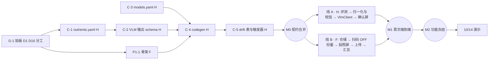

# NutriScan MVP — 开发计划

2026-09-26 · v0.2（两人协作版）

本文档把 [PRD](./PRD.md) 拆成可执行的任务。PRD 说明"做什么、为什么"，本文说明"按什么顺序、谁来做、做到什么程度算完"。本文**只放计划，不记录进度**：进度在 GitHub Issues / Projects 里跟踪（见 [CONTRIBUTING.md](../CONTRIBUTING.md)）。已定的设计决策各有一条 ADR，放在 [docs/decisions/](./decisions/)。

**两个硬日期**：2026-10-14 在 Claude Founder House Stockholm 现场演示；在此之前只做第 4.2 节"演示路线"里的内容。

**简称**：H = Hannes（线 A），F = 协作者（线 B）。

---

## 1. 决策一览

| # | 问题 | 结论 | 状态 | ADR |
| --- | --- | --- | --- | --- |
| D1 ★ | App 名称与包名 | 名称 `NutriScan`；包名用 Hannes 实际拥有的域名反写 | **待定**：Hannes 填域名 | — |
| D2 | 界面语言 | 中文、英文两份 ARB 同时做（演示观众看英文） | 已定 | [0004](./decisions/0004-ui-language.md) |
| D3 | 对象存储桶 | Backblaze B2 EU Central；每位开发者一把只写 key | 已定，P0-6 实测通过后生效 | [0001](./decisions/0001-object-storage-b2.md) |
| D4 | 营养素字段命名 | 内部主键用带单位后缀的 snake_case，EuroFIR / OFF / USDA 作映射列 | 已定 | [0005](./decisions/0005-nutrient-key-naming.md) |
| D5 | OFF 命中率 | 阈值不变（≥ 60% / < 30%），样本扩到 30 个以上条码 | 已定 | [0006](./decisions/0006-off-hit-rate-threshold.md) |
| D6 | 打包 USDA | MVP 不打包 | 已定 | [0007](./decisions/0007-no-usda-in-mvp.md) |
| D7 | ODbL 法律咨询 | 上架前再做 | 已定 | [0008](./decisions/0008-odbl-review-before-release.md) |
| D8 | 离线未命中先记账 | 数据模型现在就支持（`log_entries.nutrient_record_id` 可空）；界面推到演示之后 | 已定 | [0009](./decisions/0009-pending-extraction-entries.md) |
| D9 | 手动输入的 provenance | 新增枚举值 `manual`，CHECK 约束现在写入；手动输入时 `extraction_id` 为空 | 已定 | [0010](./decisions/0010-provenance-manual.md) |
| D10 | 照片 | 原图和派生图都存（本地 + 桶），都记 sha256，都去 EXIF | 已定 | [0011](./decisions/0011-photo-original-and-derived.md) |
| D11 | 桶对象布局 | 照片 + raw JSON + `_confirmed.v<N>.json`；无条码时的键规则；raw JSON 记 contributor、model、effort、token 数 | 已定 | [0012](./decisions/0012-bucket-object-layout.md) |
| D12 | 状态管理 / 本地库 | Riverpod + drift | 已定 | [0013](./decisions/0013-riverpod-drift.md) |
| D13 | 密钥 | 专用 Anthropic 工作区 + 工作区月度上限；每人各自的 key；`secrets.example.json`；密码管理器；CI 跑 gitleaks | 已定 | [0014](./decisions/0014-secrets-and-api-keys.md) |
| D14 | VLM 型号 | 阶段 0.5 评测后定。候选：Opus 5.5 / Sonnet 5 / Haiku 4.5；Fable 5.1 只作准确率上限参照。标准依次为：静默错误率 → P90 ≤ 25 s → 成本 | 流程已定，**型号待评测** | [0002](./decisions/0002-vlm-model-selection.md) |
| D15 | Mistral | 只进评测脚本，App 里演示前不实现；EU 退路中排第三 | 已定 | [0003](./decisions/0003-mistral-eval-only.md) |
| D16 ★ | 代码许可证 + 贡献条款 | 方案对比见第 7.3 节，由两人共同拍板。**拍板前不合并任何代码 PR** | **待定** | — |
| D17 | 服务端代理里程碑 | EU 境内推理（Vertex AI EU）与"密钥不落客户端"合并为同一个里程碑，是任何对外分发和阶段 5 的前置条件 | 已定 | [0015](./decisions/0015-server-proxy-milestone.md) |

★ = 阻塞编码，必须在 2026-09-27 之内定下来。

---

## 2. 仓库骨架与工程约定

演示前的目标结构：

```
CLAUDE.md               Claude Code 工作规则（两人共用）
CONTRIBUTING.md         协作流程
.github/                CODEOWNERS、PR 模板、workflows/
secrets.example.json    密钥模板（真实的 secrets.json 不入库）
app/                    Flutter 客户端
  lib/
    generated/          ← codegen 产物，禁止手改（CI 校验）
    data/
      db/               drift 表定义、迁移、触发器（共享契约）
      repositories/
      clients/          off/ vlm/ bucket/（全部带超时）
      upload/           上传队列 worker
    domain/             纯 Dart：归一化、规则校验、份量换算
    features/           scan/ capture/ confirm/ portion/ summary/
    l10n/               app_zh.arb、app_en.arb
  test/
api/                    阶段 4 前只放 README
schema/
  nutrients.yaml        营养素字段唯一定义（共享契约）
  nutriscan_schema/     Pydantic v2：VLM 输出结构（共享契约）
  prompts/              vlm_extract.v1.md …（文件名即版本号，产生过数据后冻结）
  codegen/              生成 JSON Schema 与 Dart 代码
  generated/            vlm_output.v1.schema.json（标准版）、vlm_output.v1.claude.schema.json（Claude 变体）
  eval/
    models.yaml         型号 ID、价格、图片上限的唯一定义（共享契约，见 3.7）
    images/ ground_truth/ results/ run.py
  tools/                阶段 0 的一次性脚本
docs/
  PRD.md  DEV_PLAN.md  LICENSES.md  decisions/  notes/
```

**schema 唯一来源的落地方式**

- `schema/nutrients.yaml`：营养素**清单**的唯一定义。
- `schema/nutriscan_schema/`：Pydantic 模型，读取 nutrients.yaml，定义 VLM 输出**结构**。
- `schema/eval/models.yaml`：型号与价格的唯一定义。
- `schema/codegen/generate.py` 一条命令产出：
  1. `schema/generated/vlm_output.v<N>.schema.json`：标准 JSON Schema，带 `minimum` / `maximum` 等约束，供 Python 端校验使用。
  2. `schema/generated/vlm_output.v<N>.claude.schema.json`：符合 Claude 结构化输出要求的变体（见 3.6）。
  3. `app/lib/generated/nutrients.g.dart`：营养素枚举、单位、标签顺序、父子关系、映射表。
  4. `app/lib/generated/models.g.dart`：App 当前使用的型号 ID、effort、图片上限。
  5. `app/lib/generated/vlm_output.g.dart`：VLM 输出的 Dart 解析类，**演示后补**。演示前手写 `app/lib/data/clients/vlm/vlm_output.dart`，并配一个测试校验它与标准 JSON Schema 一致。
- CI 重跑 codegen 后执行 `git diff --exit-code`。

**其他约定**

- 仓库**已公开**：任何密钥都不能进入 git 历史；照片一律去 EXIF；CI 跑 gitleaks。
- 外部数据许可写在 `docs/LICENSES.md`，代码注释引用它（PRD 规则 10）。
- 提交、分支、PR、合并方式见 CONTRIBUTING.md。

---

## 3. 关键技术细节

### 3.1 本地数据库（drift / SQLite）

**所有主键用 UUID（v7，文本）**，不用自增整数：两台开发机各有一个本地库，而桶里的对象、以后的同步都需要全局唯一的 ID。

| 表 | 层 | 主要列 | 删除 | 不可变列（BEFORE UPDATE 触发器） |
| --- | --- | --- | --- | --- |
| `products` | — | `id`, `barcode`（unique，可空），`brand`, `name`, `created_at` | 不删（无删除代码路径） | `id`, `barcode` |
| `photos` | 第 1 层 | `id`, `product_id`, `kind`（`original` / `derived`），`derived_from`（派生图指向原图），`local_path`, `sha256`, `width`, `height`, `taken_at`, `bucket_key`, `upload_status` | **触发器禁止** | 除 `bucket_key`、`upload_status` 外全部 |
| `extractions` | 第 2 层 | `id`, `photo_id`（送给模型的那张派生图，NOT NULL），`input_image_sha256`, `model`, `effort`, `prompt_version`, `schema_version`, `contributor`, `status`（`pending` / `done` / `failed` / `unreadable`），`raw_json`, `input_tokens`, `output_tokens`, `latency_ms`, `created_at` | **触发器禁止** | 除 `status` 外全部；`raw_json`、token 数、`latency_ms` 允许从 NULL 写入一次，之后不可改 |
| `nutrient_records` | 第 3 层 | `id`, `product_id`, `version`, `provenance`（NOT NULL，CHECK ∈ `off` / `bls` / `usda` / `vlm_user` / `manual`），`source_version`, `source_retrieved_at`, `extraction_id`, `contributor`, `basis`, `original_basis`, `serving_text`, `serving_amount`, `serving_unit`, `source_raw`, `confirmed_at` | **触发器禁止** | 全部 |
| `nutrient_values` | 第 3 层 | `record_id`, `nutrient_key`, `value_per_100`, `value_original`, `user_edited`, `derived` | **触发器禁止** | 全部 |
| `log_entries` | 用户记录 | `id`, `product_id`, `nutrient_record_id`（可空 = 待提取，D8），`consumed_at`, `amount`, `unit`, `deleted_at` | 软删除 | 无 |
| `upload_queue` | 出口 | `id`, `object_key`, `local_path`, `content_type`, `sha256`, `status`, `attempts`, `last_error`, `next_attempt_at`, `uploaded_at` | 不删（只改状态） | `object_key`, `local_path`, `sha256` |

约束要点：

- **provenance 与 extraction 的一致性**写成 CHECK：`provenance = 'vlm_user'` 当且仅当 `extraction_id IS NOT NULL`。手动输入（`manual`）没有 extraction 行（D9）。
- **append-only 触发器**：四张三层表都加 `BEFORE DELETE … RAISE(ABORT)`，再加上表中所列不可变列的 `BEFORE UPDATE OF <列> … RAISE(ABORT)`。"从 NULL 写入一次"用 `WHEN OLD.<列> IS NOT NULL` 实现。需要更新的列（`status`、`bucket_key`、`upload_status`）不加触发器。
- **迁移测试**：drift 的 schema 快照（`drift_dev schema dump`）加迁移测试。每个历史版本迁移到最新版本之后，断言 `sqlite_master` 中的触发器清单与预期完全一致。
- 这些是本地 SQLite 的触发器，不违反 PRD 规则 7（那条针对 Supabase）。
- **版本化**：同一商品新的营养素记录 `version + 1`；"当前记录" = 最新 `confirmed_at`；`log_entries` 指向具体版本。

### 3.2 归一化规则

`app/lib/domain/normalize.dart`，纯函数。

| 情形 | 处理 | 演示前 |
| --- | --- | --- |
| 标签有 per 100g / 100ml 列 | 直接取该列 | ✓ |
| kJ 与 kcal 只有其一 | 按 1 kcal = 4.184 kJ 补全，标记为派生值 | ✓ |
| 只有钠 / 只有盐 | 盐 = 钠 × 2.5，互补，标记为派生值 | ✓ |
| 总糖 / 添加糖 | 分两个字段；"davon Zucker" 映射为总糖 | ✓ |
| 膳食纤维 | 独立字段，记录来源法规是否把它计入碳水 | ✓ |
| 只有 per serving | 需要份量的克数 / 毫升数换算；演示前：标红，要求用户手填 per 100 值 | 演示后做换算 |
| 固体 vs 液体 | `per_100ml` 与 `per_100g` 不互转 | ✓ |

### 3.3 规则校验

`app/lib/domain/validate.dart`，纯函数，返回 `List<ValidationIssue>`；确认屏每次编辑后重跑。

| 规则 | 条件 | 来源 |
| --- | --- | --- |
| Atwater | \|P×4 + C×4 + F×9 − kcal\| / kcal > 15% | PRD |
| Atwater 低能量豁免 | 标示 < 40 kcal 时改用绝对偏差 > 8 kcal | 补充 |
| 质量守恒 | 脂肪 + 碳水 + 蛋白质 + 纤维 + 盐 ≤ 100 g（per 100ml 放宽到 110） | PRD |
| 子项 ≤ 父项 | 饱和脂肪 ≤ 脂肪；糖 ≤ 碳水 | 补充 |
| kJ / kcal 一致 | \|kJ − kcal × 4.184\| / kJ > 5% | 补充 |
| kJ / kcal 低能量豁免 | kcal < 20 时改用绝对偏差：\|kJ − kcal × 4.184\| > 5 kJ。标签数值四舍五入到整数，低能量时相对误差没有意义 | 补充 |
| confidence 越界 | 不在 [0, 1] 内视为解析错误（Claude 结构化输出不支持数值范围约束，由这里保证，见 3.6） | 补充 |
| 低置信度 | confidence < 阈值（阶段 0.5 按真值校准） | PRD |

各阈值是否合适，以及 Atwater 是否计入纤维 × 2 kcal/g，都在 P05-5 用评测集确定。

### 3.4 外部调用与降级

| 调用 | 超时 | 失败时 |
| --- | --- | --- |
| 本地 SQLite 查条码 | — | 主路径，< 1 秒反馈 |
| OFF `GET /api/v2/product/<barcode>?fields=…` | 4 s | 一句提示后进拍照；带规范 User-Agent；只在真实扫码时调用 |
| Claude Messages API（HTTP，无官方 Dart SDK） | 25 s，可取消 | 离线：extraction 记 `pending`（D8）；在线但失败 / 取消 / `stop_reason` 为 `refusal` 或 `max_tokens`：转手动输入 |
| 桶上传 | 30 s / 对象 | 留在队列。演示前的重试时机：启动、回到前台、每次确认后；演示后加指数退避 |

Opus 5.5 的思考模式始终开启、不能关闭，默认 effort 为 `medium`（[effort 文档](https://platform.claude.com/docs/en/build-with-claude/effort)）。App 使用的 effort 由 D14 的评测结果决定，写入 `models.yaml`，经 codegen 进入 App。

### 3.5 照片（D10）

1. `camera` 插件拍照，输出在临时目录。拍完立即把文件移到应用文档目录 `photos/<uuid>.orig.jpg`。
2. 先按 EXIF Orientation 把旋转烘焙进像素，再**去掉全部 EXIF**（含 GPS），重新编码。原图同样处理。sha256 在去 EXIF **之后**计算。
3. 派生图同时满足所选型号的两个上限：长边像素上限和视觉 token 上限（`⌈w/28⌉ × ⌈h/28⌉`）。两个数都从 `models.yaml` 读取。任一超限，API 会先缩放再处理（[vision 文档](https://platform.claude.com/docs/en/build-with-claude/vision)），那样"模型实际看到的字节"就和存档对不上了。
4. `photos` 写两行（`original`、`derived`），`extractions.input_image_sha256` 记派生图的哈希。

### 3.6 VLM 输出结构与 Claude 变体

v1 草案（P05-2 定稿）。设计原则：**所有字段 required，可空字段压到最少**。

```json
{
  "schema_version": "1",
  "unreadable": false,
  "product_name_guess": "string（未知时为空串）",
  "columns": [
    {"id": "c1", "basis": "per_100g | per_100ml | per_serving", "serving_text": "string（无则空串）", "serving_amount": "number | null", "serving_unit": "g | ml | null"}
  ],
  "nutrients": [
    {"key": "<nutrients.yaml 生成的枚举>", "column": "c1", "value": 1523, "raw_text": "1523 kJ", "confidence": 0.95}
  ]
}
```

可空字段只有 `serving_amount`、`serving_unit` 两个。

Claude 结构化输出的限制（[structured outputs 文档](https://platform.claude.com/docs/en/build-with-claude/structured-outputs)），codegen 生成 Claude 变体时逐条处理：

| 限制 | 处理 |
| --- | --- |
| 每个对象必须 `additionalProperties: false` | 变体里所有对象都加上 |
| 不支持 `minimum` / `maximum` / `multipleOf`、`minLength` / `maxLength`，数组约束只支持 `minItems` 为 0 或 1 | 变体里删掉；改由 Dart 端 `validate.dart` 保证（例如 confidence ∈ [0, 1]） |
| 可选参数总数、union 类型（含 nullable 的 `anyOf`）数量有上限，schema 过于复杂会返回 400 | 全部字段 required；nullable 只有 2 个 |
| `pattern` 只支持简单正则 | v1 不用 `pattern` |

**P05-2 的验收测试**：把生成的 Claude 变体实际发给 API（每个候选型号一次、最小请求），断言不返回 400。该测试需要密钥，标记为 `live`，本地手动运行，不进 PR 的 CI。

- VLM 自报的 confidence 不是校准过的概率，只作提示；真正的闸门是 3.3 的规则校验，以及 P05-4 测出的静默错误率。
- 保留 `raw_text`，出问题时能区分是 OCR 读错还是映射错。

### 3.7 型号配置（唯一来源）

`schema/eval/models.yaml` 是型号 ID、价格、图片上限的**唯一定义处**。PRD、DEV_PLAN、ADR 只写型号名称，不写 ID 和价格；以后出新型号，只需要在这里加一行。每行字段：

| 字段 | 说明 |
| --- | --- |
| `id` | API 型号 ID |
| `provider` | `anthropic` / `mistral` |
| `role` | `candidate` / `reference`（Fable 5.1）/ `backup`（Mistral） |
| `price_input_per_mtok`, `price_output_per_mtok` | 美元 |
| `max_image_long_edge_px`, `max_visual_tokens` | 3.5 用 |
| `supports_effort`, `effort_levels` | 评测矩阵用 |
| `source_url`, `verified_on` | 官方文档链接与核实日期 |

另有顶层字段 `app_default: {model, effort}`，codegen 据此生成 `models.g.dart`。D14 定下之前，`app_default` 暂用官方推荐的默认起点 Opus 5.5 + `low`。

### 3.8 桶对象布局（D11）

规则全文见 [ADR 0012](./decisions/0012-bucket-object-layout.md)。要点：

- 对象键前缀：`raw/<YYYY>/<MM>/<subject>_<UTC yyyyMMddTHHmmssZ>_<contributor>`。
  - `subject` 是条码。没有条码时用 `nobarcode-<product_id>`。
  - 同一次拍摄的所有文件共用这个前缀，后面加后缀：`.orig.jpg`、`.jpg`（派生图）、`.raw.json`、`_confirmed.v<N>.json`。
- 用户以后修改记录产生新 version 时，再 append 一个 `_confirmed.v<N+1>.json`，不覆盖旧文件。
- `.raw.json`：API 响应原文，外加 `model`、`effort`、`prompt_version`、`schema_version`、`input_image_sha256`、`original_sha256`、`input_tokens`、`output_tokens`、`latency_ms`、`contributor`、`requested_at`。
- 桶 client 只暴露 `put`。

---

## 4. 排期、分工与任务

### 4.1 时间与容量

| 时段 | 日期 | 每人可用 |
| --- | --- | --- |
| S0 | 周六 9/26 剩余时间 | ~3 h |
| S1 | 周日 9/27（超市不开门） | ~6 h |
| S2 | 周一至周五 9/28–10/2 晚上 | ~10 h |
| S3 | 周六 10/3（德国统一日，超市不开门）、周日 10/4 | ~12 h |
| S4 | 周一至周五 10/5–10/9 晚上 | ~10 h |
| S5 | 周六 10/10、周日 10/11 | ~12 h |
| S6 | 周一 10/12 晚上彩排；周二 10/13 路上 / 缓冲；周三 10/14 演示 | — |

**两人合计约 106 人·小时**。下面的估时已经扣掉了 4.5 节的一级砍单；review 另计，每个 PR 约 0.3–0.5 h。

### 4.2 演示路线（10/14 前必须跑通）

在演示设备上，按以下顺序现场操作：

1. **离线扫已缓存商品**：飞行模式下扫一件已缓存商品，份量屏出现，记录成功。
2. **OFF 命中**：联网扫一件 OFF 收录、但本地没缓存的商品，一步记录。
3. **拍照 → Claude 提取 → 确认屏**（演示核心）：扫一件 OFF 没收录的商品，拍营养成分表，进入确认屏，校验失败或低置信度的字段高亮。改一个值后校验即时重跑（例如把 12 改成 1.2，Atwater 立即标红）。确认后记录。
4. **当日汇总**：展示合计与记录列表，删除一条。
5. **桶**：打开 B2 控制台，展示刚才那次拍摄的原图、派生图、`.raw.json`、`_confirmed.v1.json`。

**推到演示之后**：P1-15 待提取的界面（数据模型照做）、P1-18 设置页、P1-21 连续使用一周、阶段 2（BLS）、P0-3、CI 精细化（path filter 分 workflow）、App 里的 Mistral client、VLM 输出解析类的 codegen、per serving 换算、上传指数退避。

### 4.3 两条线与汇合点

契约先由 H 一人完成，F review；契约合并之后两条线并行。对你们设想的分工，我按依赖关系做了两处调整，需要你们确认（第 7.2 节）：

- **P1-10 拍照屏从线 A 移到线 B**：它和扫码屏一样是相机与文件处理，产出的文件主要由 F 负责的上传队列消费。线 A 本来就明显更重。
- **drift 表结构（C-5）由 H 写，但放在 F 的 P1-1 骨架之后**：共享契约由一人完成，F 的骨架是它唯一的前置条件。



| 汇合点 | 目标时间 | 判定标准 | 没达成时 |
| --- | --- | --- | --- |
| **M0 契约合并** | 10/1（周四） | C-1 ～ C-5、P1-1、P1-2 都已合并到 main | 推迟超过 10/2，就执行二级砍单 |
| **M1 首次端到端** | 10/8（周四） | 在真机上走通：扫码未命中 → 拍照 → Claude → 确认屏（可以是简版）→ 份量 → 记录，上传队列里出现对应的行 | 推迟超过 10/9，就执行三级砍单（需两人决定） |
| **M2 功能冻结** | 10/11（周日）20:00 | 4.2 的演示路线在演示设备上完整跑通 | 之后只修 bug，不加功能 |

**两条线之间的接口**（在 C-5 里一并定下，先写成接口加桩实现，两边各自对着接口开发）：

| 接口 | 提供方 | 使用方 |
| --- | --- | --- |
| `ProductRepository.findByBarcode` / `saveFromOff` | F | F（扫码链路）、H（确认后写入） |
| 拍照路由：输入 `productId`，返回 `{originalPhotoId, derivedPhotoId}` | F | H（确认屏入口） |
| 确认路由：输入 `productId` 与可选的 `derivedPhotoId`，返回 `{nutrientRecordId}` | H | F（查找链路） |
| 份量路由：输入 `productId` 与可选的 `nutrientRecordId` | F | H |
| `UploadQueueRepository.enqueue(objectKey, localPath, contentType, sha256)` | F | H（P1-14） |
| `BucketKeys`：生成 3.8 的对象键 | C-5（契约） | 两边 |

### 4.4 任务表

"估时"为人·小时，已扣掉一级砍单，粗略估计，不确定性大。"时段"见 4.1。

#### 准备（G）

| 任务 | 内容 | 负责 | 依赖 | 估时 | 时段 |
| --- | --- | --- | --- | --- | --- |
| G-1 | 拍板 D1、D16、分工（7.2 节） | H+F | — | 1+1 | S0–S1 |
| G-2 | GitHub：分支保护与 rebase-only（按 CONTRIBUTING 的表）；CODEOWNERS 填入两人的用户名；按本表为每个任务建 issue 并建 Project 看板 | H | G-1 | 1.5 | S1 |
| G-3 | Anthropic：建 NutriScan 专用工作区并设月度上限，每人各一把 key | H | — | 0.5 | S0 |

#### 阶段 0 · 验证

| 任务 | 内容 | 负责 | 依赖 | 估时 | 时段 |
| --- | --- | --- | --- | --- | --- |
| P0-1 | 从购物小票里整理 30 个以上条码（含 Rewe / Lidl / Kaufland / Alnatura 自有品牌与亚洲商品） | F | — | 1 | S0 |
| P0-2 | `schema/tools/off_probe.py` 统计命中率，写 `docs/notes/off-hit-rate.md`；顺带挑出演示用的"OFF 命中"与"OFF 未收录"商品 | F | P0-1、D16 | 1.5 | S2 |
| P0-3 | BLS 字段笔记 | F | — | — | **演示后** |
| P0-4 | 评测照片 30 张以上，**超市或家中现有商品都可以**，两人各拍一半；覆盖 per 100g / per serving 两列、kJ/kcal 并列、反光、弯曲、小字，德文以外至少 3 张；入库前去 EXIF | H+F | — | 1.5+1.5 | S1–S2 |
| P0-5 | 为自己拍的那一半录入真值（七项核心字段 + 参考量） | H+F | P0-4 | 1.5+1.5 | S2 |
| P0-6 | B2 实测，结果写入 ADR 0001：只写 key 删除被拒；同名 PUT 生成新版本且旧版本仍在；hide 操作的行为；这把 key 能否修改生命周期规则。给每人各建一把 key | F | — | 2 | S0–S1 |
| P0-7 | `docs/LICENSES.md`；App 内加 OFF（ODbL）数据来源署名（演示时会展示 OFF 数据） | F | — | 0.5 | S2 |

#### 契约（C）：H 完成，F review，单独成 PR

| 任务 | 内容 | 负责 | 依赖 | 估时 | 时段 |
| --- | --- | --- | --- | --- | --- |
| C-1 | `schema/nutrients.yaml`：七项核心字段 + 纤维、钠、添加糖等；主键、单位、德国标签顺序、父字段、OFF 映射（EuroFIR / USDA 映射在 P0-3 之后补） | H | G-1 | 3 | S0–S1 |
| C-2 | Pydantic 版 VLM 输出 v1；生成标准版与 Claude 变体两份 JSON Schema（3.6）；`live` 验收测试 | H | C-1、C-3 | 3 | S1 |
| C-3 | `schema/eval/models.yaml`（3.7），数据从官方文档逐行核实，写上链接和日期 | H | — | 0.5 | S0 |
| C-4 | codegen：`nutrients.g.dart`、`models.g.dart`、两份 JSON Schema；CI 里的一致性检查 | H | C-1 ～ C-3、P1-1 | 3 | S2 |
| C-5 | drift 表、CHECK、append-only 触发器（DELETE + 不可变列 UPDATE）、UUID 主键、迁移测试框架；4.3 的跨线接口与桩实现；`BucketKeys` | H | C-4、P1-1 | 6 | S2 |
| C-R | review C-1 ～ C-5 | F | — | 2 | S2 |

#### 骨架与 CI

| 任务 | 内容 | 负责 | 依赖 | 估时 | 时段 |
| --- | --- | --- | --- | --- | --- |
| P1-1 | `flutter create`（D1 包名）；`flutter_lints`、Riverpod、drift、`mobile_scanner`、`camera`；ARB 中英两份；`secrets.example.json` 与 `.gitignore`；2 节的目录结构 | F | D1、D16 | 3 | S1 |
| P1-2 | 最简 CI（一个 workflow）：`flutter analyze && flutter test`、`ruff && pytest`、codegen diff、gitleaks、提交信息前缀检查（D16 选了 DCO 的话也查 sign-off） | F | P1-1 | 2.5 | S1–S2 |

#### 线 A（H）：schema、VLM、评测、确认屏

| 任务 | 内容 | 依赖 | 估时 | 时段 |
| --- | --- | --- | --- | --- |
| P05-3 | prompt `vlm_extract.v1.md`（kJ/kcal 并列、"davon" 缩进子项、逗号小数点、"<0,5 g"） | C-2 | 2 | S2 |
| P05-4 | 评测脚本 `schema/eval/run.py`（Claude 用官方 Python SDK，型号从 `models.yaml` 读取），指标见下表 | C-2、C-3、P0-5 | 5 | S3 |
| P05-5 | 跑评测矩阵，写 ADR 0002 的结果（型号、effort、置信度阈值、校验阈值），更新 `models.yaml` 的 `app_default` | P05-4 | 1.5 | S3 |
| P1-4 | `normalize.dart` + `validate.dart` 及单测（3.2、3.3；评测真值作夹具；"12 → 1.2"专项用例） | C-1、C-4 | 3.5 | S3–S4 |
| P1-11 | `VlmClient`：HTTP 调 Messages API；Claude 变体 schema；手写解析类 + 一致性测试；检查 `stop_reason`；记录 token 数与延迟；25 s 超时与取消 | C-2、C-4、C-5 | 4 | S4 |
| P1-12 | 确认/编辑屏：德国标签顺序、其余折叠；原图缩略；原始值 + 原始参考量 + 归一化值；低置信度与校验失败用同一种高亮并写明原因；编辑即时重跑校验；高亮字段未逐一确认时不能提交；全部通过时一键确认；"无法识别"入口 | P1-4、P1-11 | 6.5 | S4–S5 |
| P1-13 | 手动输入模式（同一屏，`provenance = manual`） | P1-12 | 1.5 | S5 |
| P1-14 | 确认后的事务写入（`nutrient_records` + `nutrient_values`），并把 3.8 的全部对象入队 | P1-12、C-5 | 3 | S5 |
| P1-16 | Widget 测试：高亮字段未确认时不能提交；"12 → 1.2"立即标红 | P1-12 | 2 | S5 |

**P05-4 评测指标**（每次调用都记录输入 / 输出 token 数，成本由 `models.yaml` 的价格算出）：

| # | 指标 | 说明 |
| --- | --- | --- |
| ① | Atwater 失败率 | PRD 原定指标 |
| ② | 逐字段准确率 | 对照 P0-5 的真值 |
| ③ | **静默错误率** | 与真值不符、**而且**没被任何校验规则或低置信度标出来的字段，占全部字段的比例。这个数决定"全部通过时一键确认"是否安全，写进 ADR 0002 作为决策依据 |
| ④ | P50 / P90 延迟 | Opus 5.5 思考始终开启，延迟必须实测 |
| ⑤ | 单次成本 | token 数 × 价格 |

**演示前的评测矩阵**：Opus 5.5（`low`、`medium`）、Sonnet 5（`low`、`medium`）、Haiku 4.5（不支持 effort 参数，只跑一档）、Fable 5.1（默认 effort，仅作参照）。Mistral 的适配器演示后再加。

#### 线 B（F）：扫码、OFF、拍照、份量、上传、汇总

| 任务 | 内容 | 依赖 | 估时 | 时段 |
| --- | --- | --- | --- | --- |
| P1-5 | Repository：Product / OFF 缓存、Log、UploadQueue 的实现（接口在 C-5 里定义） | C-5 | 4 | S3 |
| P1-6 | 扫码屏：`mobile_scanner` 7.x，打开即扫，命中震动 | P1-1 | 3 | S2 |
| P1-7 | `OffClient`：字段裁剪、4 s 超时、`nutriments` 为空视为未命中；以 `provenance = off` 写入，保存原始响应 | P1-5 | 3 | S3 |
| P1-8 | 份量屏：g 与"份"（有份量信息时）；默认值 = 上次记录的份量 | P1-5 | 2 | S3 |
| P1-9 | 查找链路：本地 → OFF → 拍照路由；各分支的一句提示 | P1-6、P1-7 | 2 | S3 |
| P1-10 | 拍照屏与照片处理（3.5）：移出临时目录、烘焙方向、去 EXIF、原图 + 派生图、sha256、写 `photos` | C-4、C-5 | 4 | S4 |
| P1-17 | `BucketClient`（S3 兼容 PUT，用现成的 SigV4 包）+ 简单上传 worker | C-5、P0-6 | 4 | S4 |
| P1-19 | 当日汇总：合计、列表、软删除；单测"合计 = 各条按份量折算之和" | P1-5 | 3.5 | S4–S5 |

#### 集成与演示

| 任务 | 内容 | 负责 | 依赖 | 估时 | 时段 |
| --- | --- | --- | --- | --- | --- |
| I-1 | M1 首次端到端，在真机上走通 | H+F | 两条线 | 2+2 | S4 |
| I-2 | M2 演示路线完整跑通并修 bug | H+F | I-1 | 3+3 | S5 |
| DEMO-1 | 演示准备：演示设备；预先缓存 1 件商品；随身带上 4.2 用到的实物商品；手机热点作为网络备份；录一段完整的备份视频；确认工作区上限；B2 控制台标签页 | H+F | I-2 | 2+2 | S5–S6 |
| DEMO-2 | 10/12 彩排 | H+F | DEMO-1 | — | S6 |

**演示后**：P0-3、P1-15（待提取界面）、P1-18（设置页、上传队列状态）、P1-20（完整验收）、P1-21（连续用一周）、per serving 换算、上传退避、VLM 解析类 codegen、Mistral 适配、CI path filter、阶段 2。演示后重新排期。

### 4.5 负载与砍单

粗略估算：

| | 线 A（H） | 线 B（F） |
| --- | --- | --- |
| 任务合计（含一级砍单） | ~57 h | ~49 h |
| review 对方的 PR | ~5 h | ~4 h |
| **合计** | **~62 h** | **~53 h** |
| 容量 | ~53 h | ~53 h |

**结论：按现在的范围，两人在 10/12 前做不完，缺口约 10 h，主要在线 A，而且完全没有缓冲。** 下面是按对演示影响从小到大排的砍单顺序。

**一级（已计入上面的估时，建议直接执行）**

- VLM 输出解析类先手写，加一致性测试，codegen 演示后补
- 只有 per serving 的标签：演示前不做换算，只标红让用户手填
- 确认屏不做原图放大
- 份量屏演示前只做 g 与"份"，ml 演示后做
- 汇总屏只能删除，不能改份量
- 上传不做指数退避
- 评测暂不做 Mistral 适配器
- P0-3（BLS 笔记）推后

**二级（M0 推迟或现在就执行，约省 8 h）**

- 只在演示设备所在的一个平台上调通，另一个平台演示后再做（省去签名、权限、真机调试的时间）
- 拍照屏用 `image_picker` 调系统相机，不自己写取景界面
- P1-13 手动输入推后；演示时若 VLM 失败，改放备份视频
- P1-16 只保留"12 → 1.2 标红"一个测试
- P0-2 推后，演示商品靠手动查 OFF 网站挑选

**三级（M1 推迟时由两人决定，都会影响演示）**

- 桶上传改成演示后再接，演示时只展示上传队列里的对象键和文件
- OFF 在线查询改为用脚本预先缓存演示商品
- 评测矩阵只跑 Opus 5.5 两档，选型演示后再做

**另一个选项是加时间**：两人各请一天假（例如 10/9 周五），多出约 12 h，基本能补上缺口。这要你们自己决定。

---

## 5. 测试策略与验收映射

| 层 | 测什么 | 怎么测 |
| --- | --- | --- |
| `schema/` | Pydantic 模型、codegen 一致性、Claude 变体能被 API 接受 | pytest；CI codegen diff；`live` 测试手动运行 |
| `domain/` | 归一化、校验、份量换算 | Dart 单测，评测真值作夹具 |
| `data/` | 触发器（DELETE、UPDATE、迁移后仍存在）、CHECK、repository、上传队列 | drift 内存库单测；外部 client 用 fake |
| `features/` | 确认屏交互规则、汇总计算 | Widget 测试 |
| 端到端 | 演示路线；PRD 验收标准 | 真机手动 |

| PRD 验收标准 | 任务 | 演示前 |
| --- | --- | --- |
| 无网络扫已缓存商品并记录 | P1-6、P1-9 | ✓（演示路线 1） |
| OFF 未收录商品拍照后 30 s 内进确认屏，可疑字段高亮 | P1-10 ～ P1-12 | ✓（演示路线 3；P05-4 统计 P90） |
| 手动把 12 改成 1.2，Atwater 立即标红 | P1-4、P1-16 | ✓ |
| 照片与 raw JSON 出现在桶里，文件名含条码与时间戳 | P1-14、P1-17 | ✓（演示路线 5） |
| 同一商品第二次扫码本地命中 | P1-7、P1-9 | ✓ |
| 当日汇总热量 = 各条按份量折算之和 | P1-19 | ✓ |
| 每条营养素记录 provenance 非空 | C-5 | ✓ |
| 评测脚本一条命令输出各模型 Atwater 失败率 | P05-4 | ✓ |

---

## 6. 风险与应对

| 风险 | 影响 | 应对 |
| --- | --- | --- |
| 线 A 负载超出容量（4.5） | 演示核心 F2 做不完 | 预先约定的三级砍单；M0 / M1 两个检查点；P1-10 已移到线 B |
| 演示现场网络不可靠 | 演示路线 2、3、5 失败 | 手机热点；离线路线 1 不依赖网络；备份视频 |
| 现场 Claude 响应慢 | 观众干等 | 按评测结果选 effort；确认屏有明确的等待态和取消按钮；备份视频 |
| VLM 置信度不可信 | 该高亮的字段没高亮 | 以规则校验为主要闸门；静默错误率作为一键确认的前提 |
| Haiku 4.5 在 Vertex AI / Bedrock 上的退役日期最早在 2026 年 10 月中旬 | 若选了 Haiku，EU 路线（D17）可能用不了 | 写进 ADR 0002，选型时一并考虑 |
| Bedrock 上的 Opus 5.5 / Sonnet 5 不支持结构化输出 | EU 路线只能走 Vertex AI | 见 ADR 0015 |
| 两人同时改共享契约 | 冲突、版本号撞车 | 契约 PR 单独提、先合先得（CONTRIBUTING 第 5 节） |
| 密钥泄露（公开仓库、密钥编进 App 包） | 产生费用或往桶里写垃圾 | 工作区月度上限；每人独立 key、可单独吊销；B2 key 只写；gitleaks；分发前完成 D17 |
| 评测照片带上个人信息 | 隐私泄露 | 去 EXIF；入库前自查画面 |

---

## 7. 对 PRD 的补充与偏离、待决事项

### 7.1 本计划对 PRD 的补充与偏离

1. **provenance 增加 `manual`**（D9）：PRD 第 3 节同步修改。
2. **离线未命中先记账**（D8）：数据模型现在做，界面推后。
3. **原图 + 派生图都存，都去 EXIF**（D10）：派生图尺寸受型号上限约束。
4. **桶对象布局**（D11）：多出 `_confirmed.v<N>.json`，有无条码两种键规则，键里带 contributor。
5. **append-only 用触发器硬性保证**，范围从 DELETE 扩大到不可变列的 UPDATE，并有迁移测试。
6. **额外的校验规则**：两处低能量豁免、子项 ≤ 父项、kJ/kcal 一致性、confidence 越界。
7. **评测指标**：在 Atwater 失败率之外，加逐字段准确率、静默错误率、P50 / P90 延迟、单次成本。
8. **营养素内部主键**用带单位后缀的 snake_case（D4）。
9. **主键用 UUID**：为多设备、多贡献者做准备。
10. **型号与价格只在 `schema/eval/models.yaml` 定义**，文档里不写 ID 和价格。
11. **Claude 结构化输出变体**：codegen 多出一份 schema，数值约束改由 Dart 端保证。
12. **服务端代理里程碑**（D17）：EU 推理与密钥不落客户端合并为一个里程碑，是分发和阶段 5 的前置条件；PRD 第 6、7 节同步修改。
13. **排期**：两人协作，以 10/14 演示为第一个目标；阶段 1 在演示后收尾。
14. **确认屏"全部通过时一键确认"**：前提是 ADR 0002 测出的静默错误率可接受。
15. **不开启 "Require review from Code Owners"**：GitHub 不允许作者批准自己的 PR，按分工只有一个 owner 的 `app/` 子目录会因此永远无法合并。"另一人必须 review"改由"至少 1 个批准"保证（CONTRIBUTING 第 2 节）。CODEOWNERS 只用来自动请求评审人。
16. **B2 的 hide 操作可能只需要写权限**：若 P0-6 实测确认如此，泄露的只写 key 可以隐藏文件（旧版本仍在）。这一点记入 ADR 0001 的风险。

### 7.2 需要你们两人决定的事项

| # | 事项 | 我的建议 / 需要的信息 | 截止 |
| --- | --- | --- | --- |
| 1 | **D1 包名** | Hannes 提供域名，包名为 `<反写域名>.nutriscan` | 9/27，P1-1 之前 |
| 2 | **D16 代码许可证 + 贡献条款** | 见 7.3。注意：仓库里**已有一份 MIT LICENSE**（初始提交，署名 EatWell Studio）| 9/27；拍板前不合并代码 PR |
| 3 | **分工** | 按 4.3：契约由 H 完成；P1-10 拍照屏移到线 B；其余按你们的设想 | 9/27 |
| 4 | **GitHub 用户名** | CODEOWNERS 里的 `@HANNES_GITHUB`、`@FRIEND_GITHUB` 两个占位符要换成真名 | G-2 |
| 5 | **怎么补上容量缺口**（4.5） | 二级砍单现在执行，还是等 M0 再定；要不要各请一天假 | 9/27 |
| 6 | **演示设备与平台** | 用谁的手机、iOS 还是 Android。决定二级砍单里"只调一个平台"具体是哪个；如果是 iOS，签名和描述文件要提前准备 | 9/27 |
| 7 | **contributor 标识** | 建议用 GitHub 用户名（写进 `secrets.json`） | C-5 之前 |
| 8 | **Haiku 4.5 是否留在候选** | 它在 Vertex AI / Bedrock 上的退役日期最早在 10 月中旬，而且不支持 effort。建议照跑，选型时把这一点算进去 | P05-5 |
| 9 | **协作者自己使用算不算"第二个真实用户"** | PRD 把它列为引入云同步的触发条件之一。建议协作开发者自用不算 | 演示后 |
| 10 | **分支保护不开 "Require review from Code Owners"** | 原因见 7.1 第 15 条，请确认 | G-2 |
| 11 | **是否有现成的规则文件（Savepoint）要合并** | 这次没有拿到路径，CLAUDE.md / CONTRIBUTING.md 是按你们的要求从头写的。如果有，给出路径，我再合并（冲突时以这次的要求为准） | 随时 |

### 7.3 D16：代码许可证与贡献条款（对比，不做推荐）

**现状**：初始提交里已经有一份 MIT LICENSE，版权人写的是 "EatWell Studio"。目前仓库里还没有代码，现在改许可证几乎没有成本；等有了双方的代码贡献再改，就需要两人都同意。以下不构成法律意见。

| 方案 | 要点 | 对商业化的影响 |
| --- | --- | --- |
| **MIT**（现状） | 最宽松、最短；只要求保留版权声明 | 任何人（包括竞争对手）都可以拿去做闭源商业产品；你们自己商业化没有障碍 |
| **Apache-2.0** | 同样宽松，另有明确的专利授权与专利报复条款，要求保留 NOTICE；第 5 条默认"贡献按同一许可证进入" | 同 MIT，专利层面更清楚；与 GPLv2-only 的代码不兼容（本项目基本不涉及） |
| **AGPL-3.0** | 强 copyleft，网络服务也要开源修改后的代码 | 竞争对手不能闭源使用，阶段 5 的 API 被人拿去做 SaaS 时也要开源。你们自己想闭源或双许可，就必须持有全部代码的权利，外部贡献需要签 CLA。另外，GPL 系许可与 Apple App Store 条款的兼容性历来有争议，上架 iOS 前要单独评估 |
| 可选的中间方案：**MPL-2.0** | 文件级 copyleft：修改过的文件要开源，新增文件不受限制 | 介于上面两者之间 |

**贡献条款**

- **DCO**（`Signed-off-by`）：贡献者声明自己有权按项目许可证提交这段代码。它**不**授予项目方改换许可证的权利。流程轻，CI 可以自动检查。
- **CLA**：贡献者额外授予项目方更多权利（通常包括再许可）。如果将来想做双许可或闭源版本，特别是在选了 AGPL 的情况下，就需要它。流程重。
- **两人内部**：比贡献条款更要紧的是代码归谁（两个人个人所有，还是 EatWell Studio 这个主体，以及它是否是法律实体）。这决定将来能不能改许可证、能不能授权给第三方，建议和 D16 一起定下来。

**和数据许可的关系**

- 代码许可证只管源代码，**不管数据**。数据的许可按 provenance 分开处理，这正是 provenance 字段存在的原因。
- OFF 数据（ODbL）：本地缓存自用不受影响。对外发布包含 OFF 数据的数据库（阶段 5 的 dump 或 API）时，衍生数据库必须按 ODbL share-alike 发布。这和代码用什么许可证无关。
- BLS（CC BY 4.0）：只要求署名 Max Rubner-Institut，任何代码许可证都兼容。
- 自有数据（`vlm_user`、`manual`）：许可由你们自己定，可以跟代码许可证不同。例如选 ODbL，便于回馈 OFF；也可以保留权利，用于 B2B 授权。
- 仓库里的非代码内容（评测照片、真值、文档）要单独写明许可。评测照片拍的是商品包装，包装设计可能受版权保护，公开前要评估，或者只公开真值、不公开照片。
